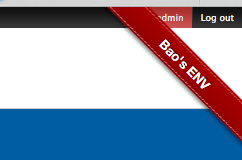

Banner for specific domains
======
Specify domains (e.g: `*.dev|*.local`) for the banner to appear:

Usage:
------
Drop `dist/banner.crx` to your Firefox

Chrome version: [baopham/banner-chrome-addon](https://github.com/baopham/banner-chrome-addon)

Requirements:
-------------
Firefox

Install:
--------

License:
--------
MIT

Author:
-------
Bao Pham
